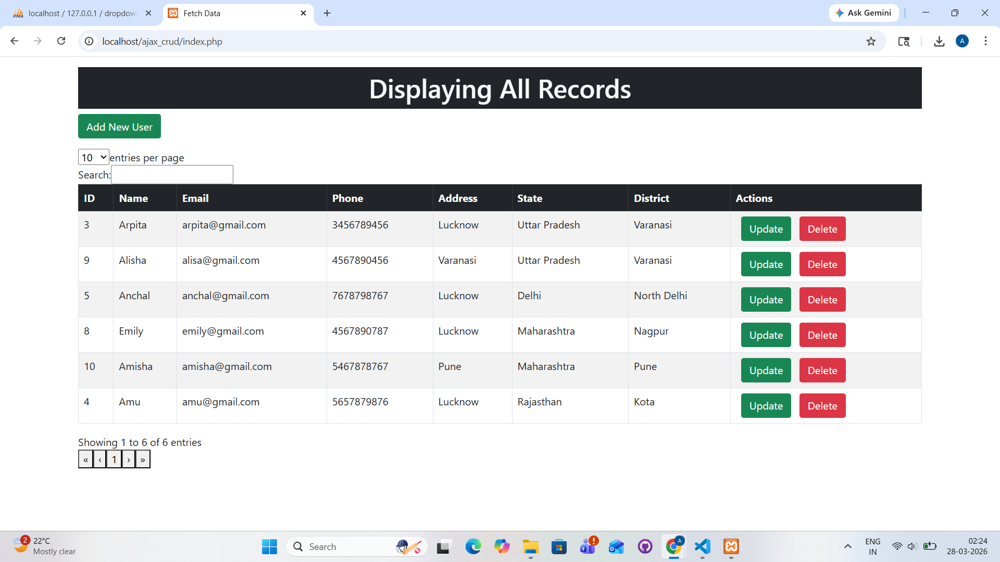

# PHP AJAX CRUD Application

## Description

This project is a PHP and AJAX-based CRUD (Create, Read, Update, Delete) application that allows users to manage data dynamically without page reload. It provides a smooth user experience with real-time updates and responsive design.

---

## Features

* Add, Update, and Delete records
* AJAX-based real-time updates (no page refresh)
* Dynamic dropdown (State & District)
* Responsive UI using Bootstrap

---

## Tech Stack

* PHP
* MySQL
* AJAX
* jQuery
* Bootstrap

---

## Project Structure

* `index.php` → Main UI
* `insert.php` → Insert data
* `update.php` → Update data
* `delete.php` → Delete data
* `fetch.php` → Fetch data
* `db.php` → Database connection
* `dropdown_db.sql` → Database file

---

## Setup Instructions

1. Download or clone this repository
2. Move the project folder to `htdocs` (XAMPP)
3. Open phpMyAdmin
4. Create a new database (e.g., `dropdown_db`)
5. Import the `dropdown_db.sql` file
6. Start Apache & MySQL in XAMPP
7. Run in browser:
   http://localhost/php-ajax-crud

---

## Screenshot

## 📸 Screenshot

---

